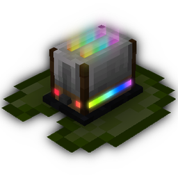

# LilyBot

 

## Links
* **Visit [our website](https://irisshaders.net) for downloads and pretty screenshots!**
* Visit [Iris's Discord](https://discord.gg/hy2329fcTZ) to chat about Iris projects and join our amazing community.
* Visit [our discord](https://discord.gg/hy2329fcTZ) to watch the development of LilyBot and get support.
* Visit [Coderbot's Patreon page](https://www.patreon.com/coderbot)
to support the continued development of Iris projects!

### Why?
* Iris had a need for a utility and moderation bot in our Discord.
Available bots were largely closed source, and having an in-house bot was preferable anyway. Hence, LilyBot!

### History
* Late in August 2021, Discord.py, the library that our previous bot utilized, was discontinued.
So [NoComment](https://github.com/NoComment1105), [Miss Corruption](https://github.com/Miss-Corruption),
[Maxigator](https://github.com/Maxigator) and [chalkyjeans](https://github.com/chalkyjeans)
took on the task of rewriting the bot in JDA.
* Then with need for features that JDA did not provide, another rewrite occurred!
This time [NoComment](https://github.com/NoComment1105), [Miss Corruption](https://github.com/Miss-Corruption),
[Maximum](https://github.com/maximumpower55) and [IMS](https://github.com/IMS212), began rewriting in Kotlin,
using the [Kord API](https://github.com/kordlib/kord) and
[KordEx Extension Library](https://github.com/Kord-Extensions/kord-extensions)
* In early 2022, we decided to expand the scope of LilyBot to be usable in other servers.

### How can I use LilyBot myself!?
* If you're looking to add Lily to your server, try our
[usage guide](https://github.com/hyacinthbots/LilyBot/blob/main/docs/usage-guide.md).
* If you're looking to set up a development environment for Lily, try our
[development guide](https://github.com/hyacinthbots/LilyBot/blob/main/docs/development-guide.md).

### What was used to write this bot and what does each thing do?
* [Kord](https://github.com/kordlib/kord), the Kotlin API for Discord.
* [KordEx](https://github.com/Kord-Extensions/kord-extensions),
an integrated commands and extensions framework for Kord. 
* KordEx's [Minecraft Mappings](https://github.com/Kord-Extensions/ext-mappings) and
[Phishing](https://github.com/Kord-Extensions/kord-extensions/tree/develop/extra-modules/extra-phishing) extensions.
* [MongoDB](https://www.mongodb.com/) and [KMongo](https://litote.org/kmongo/)
  to manage the database used for warnings, server configurations, and other small things.
* [Groovy](https://www.groovy-lang.org/), allows us to use groovy files for logback, 
* [Logback](https://github.com/qos-ch/logback), a library that makes logging prettier
* [Kotlin Logging](https://github.com/MicroUtils/kotlin-logging),
a lightweight logging that wraps slf4j with kotlin extensions
* [Github-API](https://github.com/hub4j/github-api), the API utilized by the GitHub commands
* [Shadow Gradle Plugin](https://github.com/johnrengelman/shadow),
  a tool which allows us to make a big fatjar containing all dependencies
* [detekt](https://detekt.dev/index.html), a static code analysis tool for the Kotlin programming language. This helps 
us keep our code clean and nicely formatted.

**This repo is open to contributions by the community. If you plan on contributing, please check our
[Contributor Guidelines](https://github.com/hyacinthbots/LilyBot/blob/main/CONTRIBUTING.md).**

### Contributors

