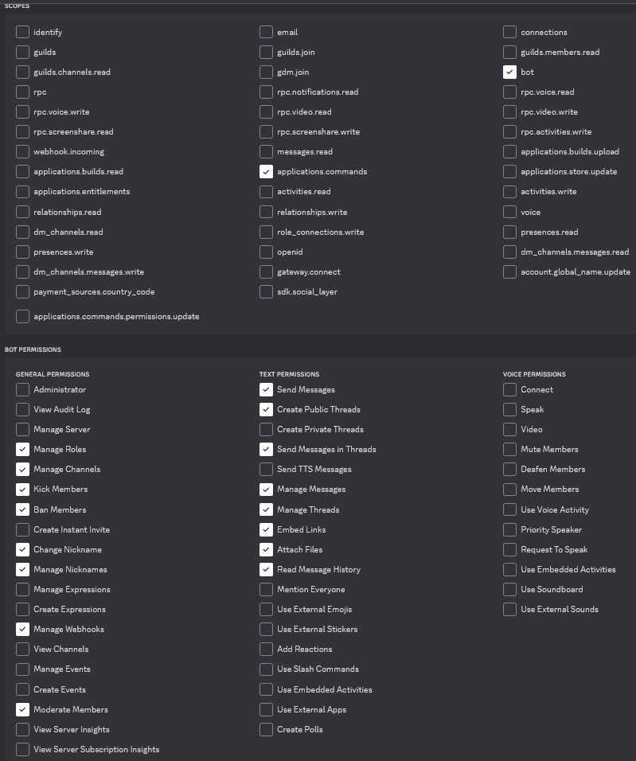

# Hosting LilyBot

This is a guide on how to **host your own instance of Lily**.
If you're looking to add Lily to your server,
try our [usage guide](https://github.com/IrisShaders/LilyBot/blob/main/docs/usage-guide.md).
If you're looking to set up a development environment for Lily,
try our [development guide](https://github.com/IrisShaders/LilyBot/blob/main/docs/development-guide.md).

If you have issues with this guide, please join [our discord](https://discord.gg/hy2329fcTZ) for support.

## Step 1 - Install tools
If you don't already have them, you will need to install [Java](https://adoptium.net/) and
[Kotlin](https://kotlinlang.org/docs/command-line.html#snap-package).

Lily utilizes MongoDB. If you don't already have that installed,
you can find a tutorial on how to install it [here](https://docs.mongodb.com/manual/administration/install-community/).

## Step 2 - Set up a bot using the discord developer portal
Head over to the [Discord Developer Portal](https://discord.com/developers/applications)
and press the "New Application" button in the top right corner.

Give your application a name and press create. Then, head to the bot tab on the left.
Click "Add Bot", then click "Yes, do it!"
Once you have your bot, head to the bot tab on the left sidebar and make sure that
`PRESENCE INTENT`, `SERVER MEMBERS INTENT`, and `MESSAGE CONTENT INTENT` switches are all toggled to on.
Then, select the OAuth2 tab and make sure that the scopes and permissions selected match the image below.


Copy the URL generated, enter it into your browser, select the server you want to add your Lily to, and click authorize.
If everything worked correctly, your Lily instance should appear in the members list of that server.

## Step 3 - Clone the repository
To clone the Lily repository, open the command line for your respective OS and run
`git clone https://github.com/IrisShaders/LilyBot.git` This will clone Lily to your home directory.

## Step 4 - Setting a `.env` file
In the root directory your project, create a file named `.env`.
You should fill your file using the format below with the relevant details filled in.

```
TOKEN=
CUSTOM_COMMANDS_PATH=
TEST_GUILD_ID=
ONLINE_STATUS_CHANNEL=
MONGO_URI=
SENTRY_DSN=
```

To get the token for your bot, return to the Discord developers portal for your bot,
go to the bot tab on the left sidebar, and under where it says `TOKEN` click copy.
BE VERY CAREFUL TO NEVER SHARE THIS WITH ANYONE AS IT PROVIDES ACCESS TO YOUR BOT.
If you ever do accidentally leak it, immediately head to that page and click the regenerate button.

The path for custom commands should be set to `commands.toml` unless you've defined your own.
If you want to learn more about setting your own custom commands,
try our [hosting guide](https://github.com/IrisShaders/LilyBot/blob/main/docs/hosting-guide.md).

To get any channel or guild IDs, you will need to have Discord's `Developer Mode` enabled.
This is located in `User Settings/Advanced/Developer Mode`.
You then simply right-click the channel, guild, user, or role and select `Copy ID`.

If you're running Mongo locally, you don't need to include a `MONGO_URI`.
If you're not running Mongo locally, you can learn how to obtain a URI
[here](https://docs.mongodb.com/guides/server/drivers/#obtain-your-mongodb-connection-string).

`GITHUB_OAUTH` is only needed if you plan on using the GitHub commands.
You can make one by going to [Settings/Developer settings/Personal access tokens](https://github.com/settings/tokens)
and clicking generate new token. You don't need to select any scopes. DO NOT SHARE THIS WITH ANYONE.

`SENTRY_DSN` is a connection string for Sentry, a logging tool.
You can find out more about it [here]( https://sentry.io/welcome/).

## Step 4.5 - Using Docker (optional)
Lily does support Docker and the official production instance utilizes it.
However, the author of this guide doesn't know how it works.
You can join [our discord](https://discord.gg/hy2329fcTZ) and ask.

## Step 5 - Starting your Mongo database
Open a terminal window and start your Mongo database using the respective command for your OS.
You can find information on this command in the
[installation guide](https://docs.mongodb.com/manual/administration/install-community/) for your OS.

You'll want to use the command to stop the database whenever you finish a development session.
This command can be found in the same place as the one for starting the database.

## Step 6 - Building Lily
After your `.env` file is successfully established, reopen the command line. Run `cd LilyBot`
and then run `gradlew build` if you're on Windows and `./gradlew build` if you're on Mac or Linux.
This might take a while but the output should eventually say `BUILD SUCCESSFUL`.

## Step 7 - Running Lily
To run Lily, open your favorite file manager and navigate to `LilyBot/builds/lib`
Find the file with a `-all` at the end, for example `LilyBot-1.0-all.jar`.
Copy this file to the directory that contains your `.env` and `commands.toml` files.
Then, reopen the command line and run the command `java -jar LilyBot-1.0-all.jar` where `LilyBot-1.0-all.jar`
is the name of the `.jar` file you found before.
You should receive a message in your designated online status saying that Lily is online.

## Step 8 - Profit
Congrats! You now have your own fully functioning instance of LilyBot!

For more information on all of Lily's commands,
check out the [command list](https://github.com/IrisShaders/LilyBot/blob/main/docs/commands.md).

If you're running this your own server, please be sure to allow the `Send Messages`, `Send Messages In Threads`,
`Add Reactions`, and `Use Application Commands` permissions for your moderator role and any other role you want to be
able to send messages when the server is locked.

We suggest joining [our discord](https://discord.gg/hy2329fcTZ)
for support, announcements of releases, Lily's online status, and even more!


## Step 8 - Configuring Lily by editing commands.toml (optional) (DEPRECATED)
You can add your own custom commands in a file with the `.toml` suffix.
You will need to specify the path and name of this file in the `CONFIG_PATH` section of your `.env` file.
The default `commands.toml` is what is used on the Iris server.
Custom commands can only be used to create a simple slash command that sends an embed with text.

To establish your own configuration, create a `.toml` file.
Anything stored in this file is in the form of a key (e.g. `name`) and a value (e.g. `Rule 1`)
seperated by an equals sign (e.g. `name = Rule 1`) Each key and value should be on a new line.
In the default file, keys are grouped by the command they create and loosely alphabetized.
At the top of the file, create a key `commands` and specify, seperated with a space,
a list of all the commands you would like.
For example, if we wanted commands `/help`, `/rules`, and `/welcome` this first entry would look like
`commands = help rules welcome`. Next, you will need to define the help, title, and description for each command.
The help value is what appears in Discord's autofill when typing in the command,
the title is displayed at the top of the command in bold and a slightly larger font,
and the description is the body of the command. Each of these must be defined on its own line.
So if we wanted the `/welcome` command to have a help of `Welcomes a user to to the server!` a title of `Welcome!`
and a body of `Welcome to the server! Be sure to read the rules and have a great time!` that would look like

```toml
[[command]]
name = "welcome"
help = "Welcomes a user to the server!"
title = "Welcome!"
description = "Welcome to the server! Be sure to read the rules and have a great time!"
```

The other component of custom commands is children.
These are commands that all have the same prefix and various different second values
(e.g. Iris uses children for our rule commands).

```toml
[[command.subcommand]] 
name = ""
help = ""
title = ""
description = ""
[[command.subcommand]]
name = ""
help = ""
title = ""
description = ""
```

Each different subcommand needs to be seperated into a different array with `[[command.subcommand]]`,
similar to how we initially defined commands. Each command also needs a help, title, and description.
For example, the Iris Discord's rule 1 command is defined as

```toml
[[command.subcommand]]
name = "Rule 1"
help = "Reminds the user of Rule 1: Be decent to one another."
title = "Rule 1"
description = "Be decent to one another. We're all human. Any and all forms of bigotry, harassment, doxxing, exclusionary, or otherwise abusive behavior will not be tolerated. Excessive rudeness, impatience, and hostility are not welcome. Do not rage out or make personal attacks against other people. Do not encourage users to brigade/raid other communities."
```

Be aware that it may take Discord a moment to refresh any commands changed in this way.
You will need to restart the bot after you make any changes in this way.
